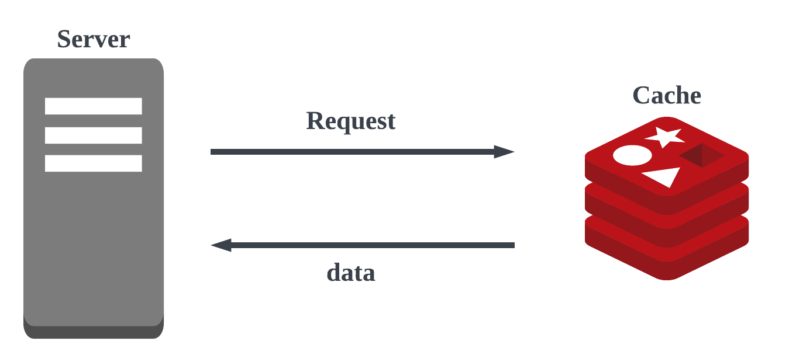
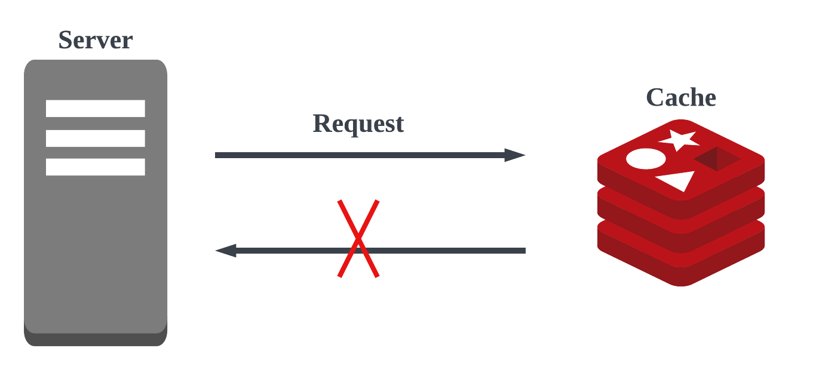
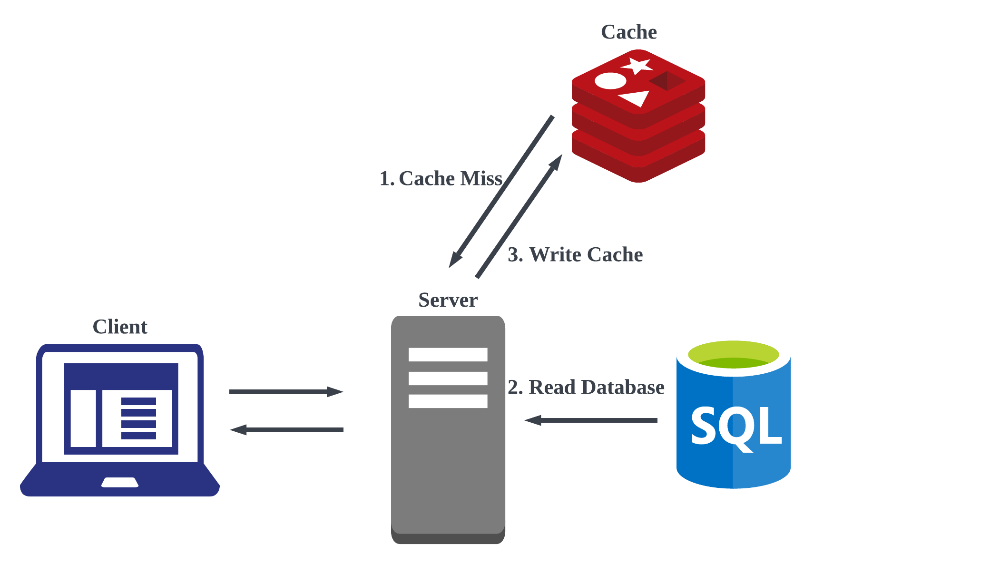

# Redis

**Remote Dictionary Server**
 
Open Source In-Memory Data Store written in ANSI-C
  
다수의 서버를 사용하는 분산 환경의 서버가 공통으로 사용할 수 있는 hash table
  
Remote:  
각각의 서버안에 로컬하게 존재하지 않고 다수의 서버에서 공통적으로 사용할 수 있도록 원격으로 존재한다. 
Dictionary:  
key-value 값을 가지는 상수의 시간 복잡도  

### 특징
- In-Memory 모든 데이터를 RAM에 저장 (백업 / 스냅샷 제외)
- Single Threaded 단일 thread에서 모든 task 처리
- Cluster Mode 다중 노드에 데이터를 분산 저장하여 안정성 & 고가용성 제공
- Persistence RDB(Redis Database) + AOF(Append only file) 통해 영속성 옵션 제공
- Pub/Sub Pub/Sub 패턴을 지원하여 손쉬운 어플리케이션 개발 (e.g 채팅, 알림 등)

### 장점
- **높은 성능**
 모든 데이터를 메모리에 저장하기 때문에 매우 빠른 읽기/쓰기 속도 보장
- **Data Type 지원**
 Redis에서 지원하는 Data type을 잘 활용하여 다양한 기능 구현
- **클라이언트 라이브러리**
 Python, Java, JavaScript 등 다양한 언어로 작성된 클라이언트 라이브러리 지원
- **다양한 사례 / 강한 커뮤니티**
 Redis를 활용하여 비슷한 문제를 해결한 사례가 많고, 커뮤니티 도움 받기 쉬움

### 사용 사례
- Caching
    - 임시 비밀번호(One-Time Password)
    - 로그인 세션(Session)
- Rate Limiter 
    - Fixed-Window / Sliding-Window Rate Limiter(비율 계산기)
- Message Broker 
    - 메시지 큐(Message Queue)
- 실시간 분석 / 계산 
    - 순위표(Rank / Leaderboard)
    - 반경 탐색(Geofencing)
    - 방문자 수 계산(Visitors Count)
- 실시간 채팅 
    - Pub/Sub 패턴

### Persistence(영속성)
- Persistence
    - Redis는 주로 캐시로 사용되지만 데이터 영속성을 위한 옵션 제공
    - SSD와 같은 영구적인 저장 장치에 데이터 저장
- RDB(Redis Database)
    - Point-in-time Snapshot -> 재난 복구(Disaster Recovery) 또는 복제에 주로 사용
    - 일부 데이터 유실의 위험이 있고, 스냅샷 생성 중 클라이언트 요청 지연 발생
- AOF(Append Only File)
    - Redis에 적용되는 Write 작업을 모두 log로 저장
    - 데이터 유실의 위험이 적지만, 재난 복구시 Write 작업을 다시 적용하기 때문에 RDB 보다 느림
- RDB + AOF 함께 사용하는 옵션 제공

### 캐싱(Caching)
-  데이터를 빠르게 읽고 처리하기 위해 임시로 저장하는 기술
- 계산된 값을 임시로 저장해두고, 동일한 계산 / 요청 발생시 다시 계산하지 않고 저장된 값
- 캐시(Cache) = 임시 저장소 (바로 사용)
  
- **사용 사례**
    - CPU 캐시: CPU와 RAM의 속도 차이로 발생하는 지연을 줄이기 위해 L1, L2, L3 캐시 사용
    - 웹 브라우저 캐싱: 웹 브라우저가 웹 페이지 데이터를 로컬 저장소에 저장하여 해당 페이지 재방문시 사용 
    - DNS 캐싱: 이전에 조회한 도메인 이름과 해당하는 IP 주소를 저장하여 재요청시 사용
    - 데이터베이스 캐싱: 데이터베이스 조회나 계산 결과를 저장하여 재요청시 사용
    - CDN: 원본 서버의 컨텐츠를 PoP 서버에 저장하여 사용자와 가까운 서버에서 요청 처리
    - 어플리케이션 캐싱: 어플리케이션에서 데이터나 계산결과를 캐싱하여 반복적 작업

### Cache Hit / Miss

✅ **Cache Hit**

  
❌ **Cache Miss**
 

 ### Cache-Aside patter
  